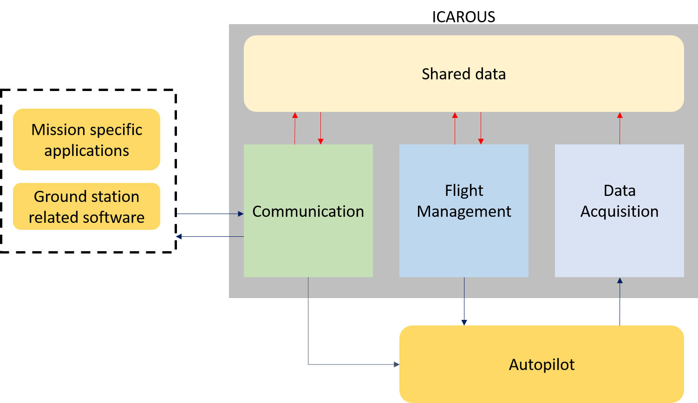

The ICAROUS software architecture:
==================================

At the top level there are three core threads within ICAROUS:

1. Data acquisition thread: The data acquisition thread (DAQ) is responsible for reading data from a specified input port (serial or socket). Data transfer is accomplished using MAVLink packets. The incoming MAVLink messages are stored in a shared data structure (class MAVLinkMessages) that can be accessed by all other threads. 

2. Communication thread: Enables interaction with ICAROUS from a ground station via MAVLink messages. The COM thread passes MAVLink Messages streaming from the autopilot to the ground station. The COM thread also passes commands from the ground station (intended for the autopilot) directly to the autopilot.

3. Flight management thread: The flight management thread is responsible for making all flight related decisions, monitoring flight conditions for conflicts and resolving conflicts if necessary. Conflict detection and resolution is established using hierarchical finite state machines.

ICAROUS package description
---------------------------

class Interface:
- Enables communication over a serial port or socket.
- Contains functions to read/write raw data and MAVLink packets.
- Provides a function to pass data between two interfaces.

class MAVLinkMessages:
- A data structure to hold incoming MAVLinkMessages.
- Contains synchronized functions to decode incoming MAVLink packets.
- Functions to access to the latest MAVLink messages.

class AircraftData:
- A data structure that holds relevant flight data such as aircraft state information, flight plan, geofence information and traffic information.
- Contains additional helper functions to read/send flight plans, geofences to/from a ground station/pixhawk flight controller. 

class Aircraft:
- Provides functions to send various commands to a pixhawk autopilot.
- Implements a finite state machine that enables autonomous flight through takeoff,climb,cruise and land.

class GeoFence:
- A data structure that holds geofence related information.
- Contains member functions that make use of polycarp routines to determine containment for keep in/out geofences and determine recovery points.

class GenericObject:
- A data structure to hold traffic/obstacle/mission related object information.

class Conflict:
- A data structure that is used to capture conflict information.
- Provides helper function to update and maintain a list of conflicts.

class FSAM:
- Provides conflict detection and resolution functions.
- The monitor function checks for geofence, traffic and standoff distance related conflicts.
- Detected conflicts are added to the conflict queue.
- The resolution function computes and executes a resolution in the form of a resolution plan or a manuever sequence.

class Icarous:
- The main entry point for ICAROUS. Sets up all the relevant threads and ICAROUS operating modes (active/passive/passthrough).
- In active mode, ICAROUS detects, logs and resolves conflicts
- In passive mode, ICAROUS only detects and logs the conflicts. It does not interfere with the autopilot's operation.
- In passthrough mode, ICAROUS simply passes packets between a ground station and the autpilot.

class FMS:
- Implements the flight management thread.

class DAQ:
- Implements the data acquisition thread.

class COM:
- Implements the communication thread.

class BCAST:
- Implements a broadcasting loop. This enables other onboard applications to obtained data from ICAROUS.

ICAROUS Finite State Machines
-----------------------------

Conflict detection and resolution is established using hierarchically structured finite state machines. The hierarchy is show in the following figure:

The above phase based state transition is implemented by the Aircraft class.

The execution of a resolution is governed by the following state machine:

The intial state [S0] computes a resolution based on the available conflicts in the conflict queue. Some conflicts are resolved using a resolution maneuver [S1] (e.g. avoid traffic by a sequence of guided maneuvers) whereas some conflicts are resolved using an elaborate resolution flight plan [S2] (e.g. plotting a path to avoid an obstacle). After a resolution plan, state S3 computes an intermediate plan to join the original mission. State S4 resumes the original mission once the vehicle is back on the original flight plan. State S5 is a final state free of conflicts.
